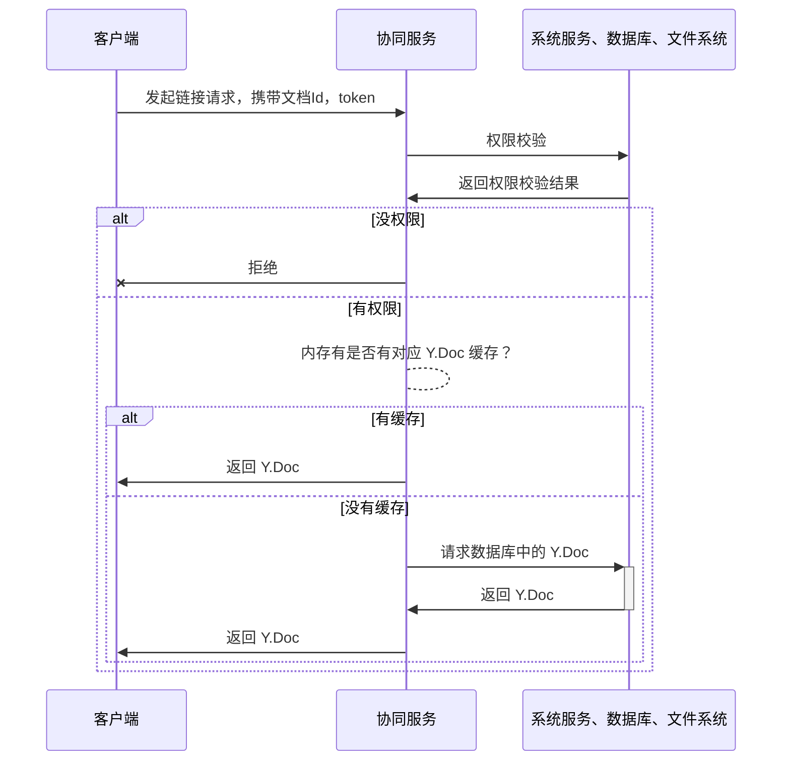
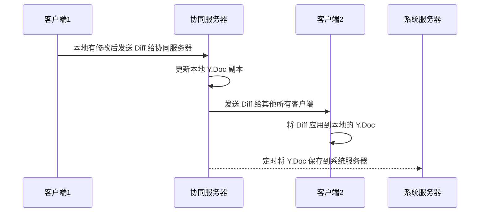

# yjs 实战

> 本文主要讲述如何使用 Hocuspocus 和 Yjs 为富文本编辑器实现协同编辑功能。
>
> 
>
> 目前，大部分关于协同编辑与 Yjs 的文章偏向理论和功能介绍，实战方面的内容相对较少，尤其是关于如何搭建协同服务器的文章更是凤毛麟角。
>
> 
>
> 本文希望能够为 Yjs 如何在实际工作中落地提供一些具体的思路和操作方法。

## 1. yjs 简介

网上已经有很多关于 yjs 的介绍文章了，包括功能、原理和实现方式。本文主要偏向实战，就不赘述了。


下面简单回顾一下 yjs 中比较重要的概念:

### 共享数据类型 （Shared Types）

有 `Y.Text`，`Y.Map`，`Y.Array`， 和能表示树状结构的 `Y.XmlFragment`，`Y.XmlElement`，`Y.XmlText`。这些数据类型用起来和普通的类型一样，但是却能做到在多人修改时自动合并所有操作，且不会产生冲突。


```ts
import * as Y from 'yjs'

// Yjs documents are collections of
// shared objects that sync automatically.
const ydoc = new Y.Doc()
// Define a shared Y.Map instance
const ymap = ydoc.getMap()
ymap.set('keyA', 'valueA')

// Create another Yjs document (simulating a remote user)
// and create some conflicting changes
const ydocRemote = new Y.Doc()
const ymapRemote = ydocRemote.getMap()
ymapRemote.set('keyB', 'valueB')

// Merge changes from remote
const update = Y.encodeStateAsUpdate(ydocRemote)
Y.applyUpdate(ydoc, update)

// Observe that the changes have merged
console.log(ymap.toJSON()) // => { keyA: 'valueA', keyB: 'valueB' }
```


### Y.Doc

`Y.Doc`是一个共享数据的集合，同时也是由它来实现 yjs 提供同步、合并能力。所有的共享数据类型都必须由 `Y.Doc`对象创建。

### 共识（Awareness）

共识用来共享不需要合并功能且不需要持久化的数据，例如光标位置、用户的名字、颜色等等。不属于 yjs 的核心功能，不过对开发协同编辑器帮助很大。

### UndoManager

可以为 `Y.Doc` 提供撤销和重做功能。

### Editor Binding

为不同的编辑器的数据结构提供 yjs 的协同功能，比较流行的编辑器如 `ProseMirror` 、 `monaco`、 `Slate` 、`Quill` 都有相应的 Binding


### 工作流程

下面这段代码就完整的描述了 yjs 的工作流程

```ts
// 首先有 2 个 Y.Doc 实例
const doc1 = new Y.Doc(); 
const doc2 = new Y.Doc();

// 每个 Doc 实例在自己修改时需要将 diff 信息通知给别的 Doc 实例
doc1.on('update', (update: Uint8Array) => {
  // 然后每个 Doc 实例在接收到别的 Doc 更新消息时，将 Diff 应用到自身
  Y.applyUpdate(doc2, update);
});

doc2.on('update', (update: Uint8Array) => {
  Y.applyUpdate(doc1, update);
});

// 从 Doc 实例中创建一个叫 myarray 的共享数组
// 对该数组进行数据操作
doc1.getArray('myarray').insert(0, ['Hello doc2, you got this?']);

// 所有实例的 myarray 的数据都是实时同步的
doc2.getArray('myarray').get(0); // => 'Hello doc2, you got this?'
```

所有的 yjs 的应用都是和上面的流程一模一样的。区别无非就是

- 每个 `Y.Doc`实例是在不同的地方，可能在不用用户的浏览器，也可能在服务端，甚至不是 javascript 环境，或者被持久化在了数据库中，但本质上都是 `Y.Doc`实例
- 通知的方式不一样，这里就是同一个 js runtime，别的情况可能是运行在 web worker 里面，通过 postMessage 进行通知，也可能是在服务端，通过 WebSocket 通知，也可能是别的浏览器，通过 WebRTC 通知。当然也能通过 http 轮询获取。


## 2. 协同服务需要做的事情

有了上面的铺垫，那么服务端需要做的事情就很清晰了


> - 分发 diff 消息
>   - 通过 WebScoket 和所有客户端建立联系（星形）
>   - 将每个`Y.Doc`实例发出的 diff 数据分发给其他所有的`Y.Doc`实例
>- 持久化
>   - 在合适的时机将 `Y.Doc`保存到数据库中（二进制数据）
>   - 当有客户端新接入的时候，将对应文档的 `Y.Doc`发送给他，如果内存中没有 `Y.Doc`的缓存，则从数据库中获取 二进制数组来重建 `Y.Doc`
>- 用户验证
>- 提供文档的默认值（推荐）


### 客户端连接协同服务流程



### 更新数据流程




## 3. Hocuspocus

hocuspocus 是 `tiptap` 编辑器的作者开源的 yjs 协同服务器，相对于`y-websocket`， hocuspocus 提供了更多了方便落地协同编辑的功能，且使用非常方便，只需要实现相应的 hook 即可。hocuspocus 的 hook 非常多（18 个），可以灵活使用。


同时 hocuspocus 也提供了很多 extension，能满足各种不同的需求。


hocuspocus 由 typescript 编写，总体代码量不多，对于前端团队用起来没什么障碍。本文后面也会提供别的服务器方案。


需要注意的是，hocuspocus 有自己的通讯协议，与 y-websokcet 不兼容，所以前端需要使用 `@hocuspocus/provider` 来连接 hocuspocus server。


在使用中，我们通常实现 `onAuthenticate`、`onLoadDocument`、`onStoreDocument` 3 个 hook 即可，对应了用户验证、读取 Y.Doc、保存 Y.Doc，hocuspocus 会自动处理 update 消息的转发。 


hocuspocus 在持久化`Y.Doc`时会有节流功能，针对相同 id 的，`Y.Doc`默认是 2 秒保存一次，可以通过 debounce 字段配置。


在实际业务中，我们通常是由后台服务提供接口（RPC等）来进行身份验证和二进制文件的保存、读取。这时候只需要自己实现这 3 个 hooks 即可，使用起来非常简单。


接下来我们实战一下

## 4. 实战: 为 Block Suite 提供协作服务

代码在 [ununian/blocksuite-demo (github.com)](https://github.com/ununian/blocksuite-demo)


先用使用 bun 或者 ts-node 运行 server.ts ，然后再运行 vite dev 


效果如下：


我们来看看每个文件的作用


```ts
// main.ts 客户端代码

import { AffineSchemas } from '@blocksuite/blocks';
import { AffineEditorContainer } from '@blocksuite/presets';
import '@blocksuite/presets/themes/affine.css';
import { nanoid, Schema } from '@blocksuite/store';
import { DocCollection } from '@blocksuite/store';
import { CollaborationServerProvider } from './provider';

const schema = new Schema().register(AffineSchemas);
const collection = new DocCollection({
  schema,
});
collection.start();
collection.meta.initialize();
const doc = collection.createDoc({ id: '11' }); // 这里设置文档 id
// 这上面都是 block-suite 原有 demo 中的代码

async function connect() {
  const nameInput = (document.querySelector('#name') as HTMLInputElement)!;
  if (!nameInput.value) {
    nameInput.value = nanoid();
  }

  const provider = new CollaborationServerProvider(
    doc.id,													// doc.id 会传递给 Provider，是服务端 hook 中的 documentName
    doc.spaceDoc, 									// 将 Y.Doc 传递给 Provider，同步数据
    doc.awarenessStore.awareness,		// 将 awareness 传递给 Provider，同步用户信息（光标等）
    'token',												// 传 token 给服务器进行身份验证，下面为用户信息
    {
      id: nanoid(),
      name:
        (document.querySelector('#name') as HTMLInputElement)!.value ||
        nanoid(),
    }
  );

  doc.load();

  const editor = new AffineEditorContainer();
  editor.doc = doc;
  document.body.append(editor);
}

const createBtn = document.getElementById('connect') as HTMLButtonElement;
createBtn.onclick = () => connect();

```


```ts
// provider.ts 客户端 provider

import { Slot } from '@blocksuite/store';
import {
  HocuspocusProvider,
  HocuspocusProviderWebsocket,
} from '@hocuspocus/provider';
import type { Awareness } from 'y-protocols/awareness';
import * as Y from 'yjs';

const CollaborationUrl = `ws://localhost:4333`;

export class CollaborationServerProvider {
  private _websocket: HocuspocusProviderWebsocket; 	// 可以多个 Provider 共享一个 ws 链接，Hocuspocus支持多路复用

  public provider: HocuspocusProvider;
  public whenReady: Promise<void>;									// whenReady 和下面很多事件都是实际业务中需要处理的，但和协同本身关系不大

  public slots = {
    authenticated: new Slot<'readonly' | 'read-write'>(),
    authenticateFailed: new Slot<void>(),
    serverError: new Slot<void>(),
    synced: new Slot<void>(),
    statelessMessage: new Slot<string>(),
  };

  constructor(
    documentId: string,
    doc: Y.Doc,
    public readonly awareness: Awareness,
    public readonly token: string,
    public readonly user: { id: string; name: string }
  ) {
    this._websocket = new HocuspocusProviderWebsocket({	//自己实现多 Provider 共享 ws 即可，避免多篇文档时发起多个 ws 链接
      url: CollaborationUrl,
    });
    this.provider = new HocuspocusProvider({
      websocketProvider: this._websocket,
      name: documentId,																// 服务端的 documentName
      document: doc,
      token,
      awareness,																			// 这里传递 awareness 就可以实现共享用户信息
      onAuthenticationFailed: (e) => {								// 用户验证失败处理
        if (e.reason === 'Server Error') {
          this.slots.serverError.emit();
        } else {
          this.slots.authenticateFailed.emit();
        }
      },
      onAuthenticated: () => {												// 用户验证成功，权限处理
        this.slots.authenticated.emit(
          (this.provider.authorizedScope || 'readonly') as
            | 'readonly'
            | 'read-write'
        );
      },
    });

    this.provider.on('stateless', ({ payload }: { payload: string }) => {
      this.slots.statelessMessage.emit(payload);
    });

    this.provider.setAwarenessField('user', {					// 设置本地用户信息，这样另外的客户端就能拿到这个信息来显示了
      name: this.user.name,
      id: this.user.id,
    });

    if (this.provider.isSynced) {
      this.whenReady = Promise.resolve();
    } else {
      this.whenReady = new Promise((resolve) => {
        const fn = () => {
          this.provider.off('synced', fn);
          resolve();
        };
        this.provider.on('synced', fn);
      });
    }
  }

  cleanup() {
    this.provider.destroy();													// 记得页面退出时销毁
    this._websocket.destroy();
  }
}

```

```ts
// server.ts 协同服务

import { nanoid } from '@blocksuite/store';
import { Server } from '@hocuspocus/server';
import fs from 'node:fs';
import * as Y from 'yjs';

const server = Server.configure({
  port: 4333,
  yDocOptions: { gc: false, gcFilter: () => false }, // 关闭 GC 是为了做历史版本功能
  onAuthenticate: async (payload) => {				// 用户验证 hook
    if (payload.token) {
      if (payload.token === 'readonly') {
        payload.connection.readOnly = true;		// 如果用户不能修改文档，需要这样设置
      }

      return {
        user: {},
      };
    } else {
      // 如果用户验证失败，没权限访问该文档时，直接抛出异常即可，客户端能收到这个异常的 message
      throw new Error('Authentication failed');  
    }
  },
  
  // 读取二进制文件，这里用本地文件系统，在实际业务中通常是通过接口（RPC）访问后台服务或者数据库、s3 等
  onLoadDocument: async (payload) => {				
    const { documentName } = payload;
    const path = `./data/${documentName}.yjs`;

    if (fs.existsSync(path)) {
      const doc = new Y.Doc();
      const docData = fs.readFileSync(path);
      const uint8Array = new Uint8Array(docData);
      Y.applyUpdate(doc, uint8Array);
      return doc;
    } else {
      // 重点：推荐在服务器进行初始化赋值，后面会说原因，如果不需要的话，直接返回 new Y.Doc() 即可
      return createEmptyDocument(); 
    }
  },
  
  // 保存二进制文件，这里用本地文件系统，在实际业务中通常是通过接口（RPC）访问后台服务或者数据库、s3 等
  // 这个同一个 Y.Doc 会有节流，默认是两秒
  onStoreDocument: async (payload) => {
    const { documentName, document } = payload;
    const path = `./data/${documentName}.yjs`;

    const update = Y.encodeStateAsUpdate(document);
    fs.writeFileSync(path, update);
  },
});

server.listen();

// 下面是 block-suite 的初始化模板
const createEmptyDocument = async () => {
  const doc = new Y.Doc();
  const blocks = doc.getMap('blocks');

  // ...

  return doc;
};

```

这样我们就完成了为 block-suite 添加协同服务的工作。对于其他编辑器，原理也是一样的，只要提供 `Y.Doc` 和 `Awareness` 即可。

## FAQ

> * Q: 为什么要在服务端进行初始化赋值
> * A: 在实际业务中，通常是先通过接口创建一个文档，然后返回 ID，前端再通过这个 ID 连接到协同服务。
>   * 如果在前端进行初始化，那就有可能造成初始化很多次，因为 yjs 的特性，合并时会把所有的初始化操作都执行一次，造成数据重复
>   * 特别是在协同服务不稳定，或者客户端网络不稳定，或者储存服务不稳定时都会出现这种情况
>     * 举个例子，例如用户 编辑了一篇文档，写了很多内容，也保存成功了。
>     * 第二次进来时，这时候服务不稳定，那客户端就会重新写一份默认值，然后通知协同服务保存
>     * 这时候 yjs 的特性会将 2 份数据合并，造成数据重复。
>   * 这样的数据是比较可怕的，例如 block-suite 有一个 root 节点，如果有多个 root 节点，就会渲染最新的 root，那之前 root 节点的内容在用户看来就是丢了。


> * Q: 需要储存的二进制文件的大小是多少？
>
> * A: 具体大小可以参考参见 https://github.com/dmonad/crdt-benchmarks
>
>   - 其中 B4 为，一共插入 182315 次单字符，一共删除 77463 次单字符，259778次操作，最终文件 104852 个字符
>     - 二进制大小 159KB
>
>   - B4 x 100 为100次B4操作，最终文件大概1000W个字符
>     - 二进制大小 15.9 M


> 后面我还会写 2 篇文章关于如何实现`离线编辑`和`历史版本`（包括历史版本显示、回退、创建副本、版本对比）
>
> 
>
> 如果针对实现 yjs 的协作服务有任何问题，都欢迎在评论中交流


## 附录: 性能问题与其他的协同服务实现方式

hocuspocus 的问题在于，性能相对来说比较差且扩展起来比较麻烦，只能使用多实例的方式来扩展。因为 yjs 合并更改是一个 cpu 密集型的操作，然后 nodejs 是单线程的，所以一个大文档编解码时会将整个服务卡主。


> figma 也遇到了相同的问题，和我们一样 figma 也有一个比较大的编解码负载，可以看看这篇博客的解决思路
>
> [How Mozilla’s Rust dramatically improved our server-side performance | Figma Blog](https://www.figma.com/blog/rust-in-production-at-figma/#scaling-our-service-with-rust)

### 已有的后台（非 js） + y-crdt ( FFI )

https://github.com/y-crdt/y-crdt


完全由现有的后台来实现 ws 链接，分发消息、权限、持久化，然后利用 y-crdt 提供的 C 静态库，通过 FFI 来处理 yjs 相关数据


> 优点: 
>
> * 性能比较高
> * 利用现有技术栈，且与现有系统集成更加方便
> * 不需要额外服务器，减少运维成本


> 缺点:
>
> * 需要完全由自己开发


### 使用 y-sweet 或者 OctoBase

这两个库都是使用 Rust 写的 yjs 服务端，性能高而且能使用多线程编解码，单机的扩展只需要增加核心数就能完成。

不过这 2 个库都比较难做到开箱即用，需要能自行修改代码，这对没接触过 Rust 的开发来说比较困难。
